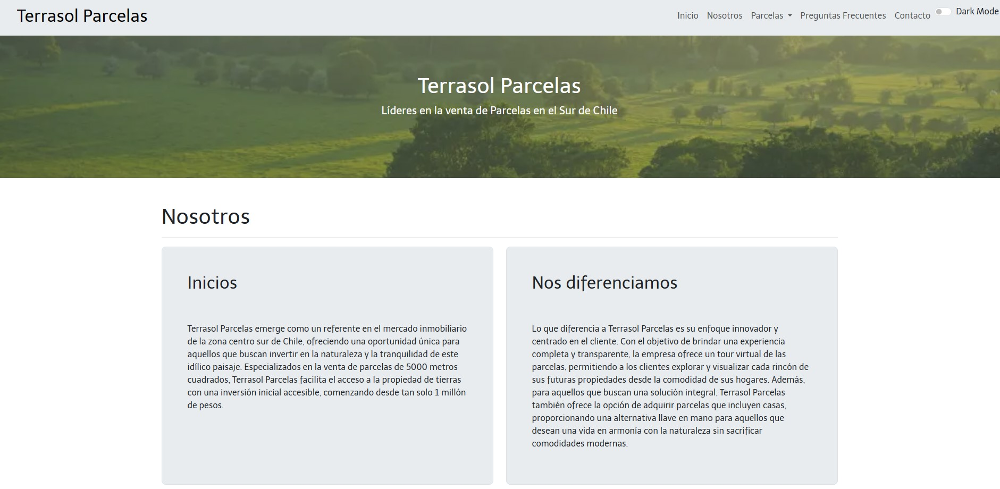
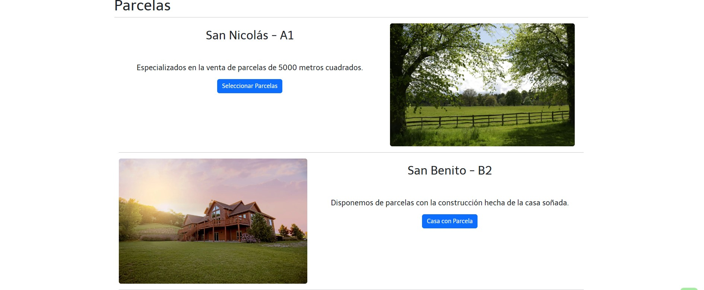
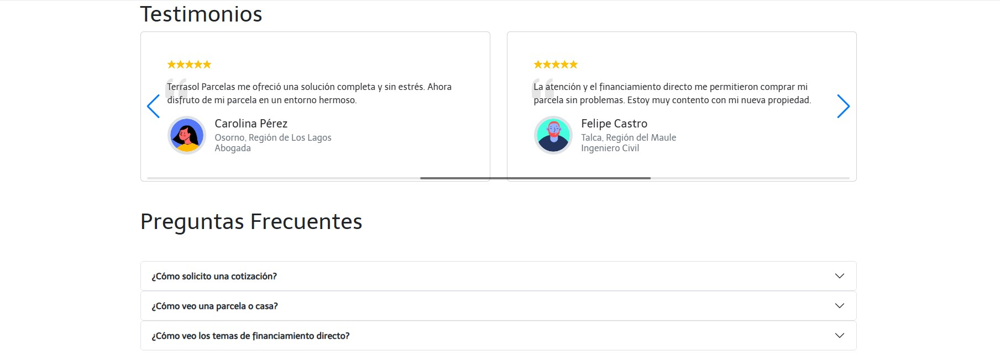
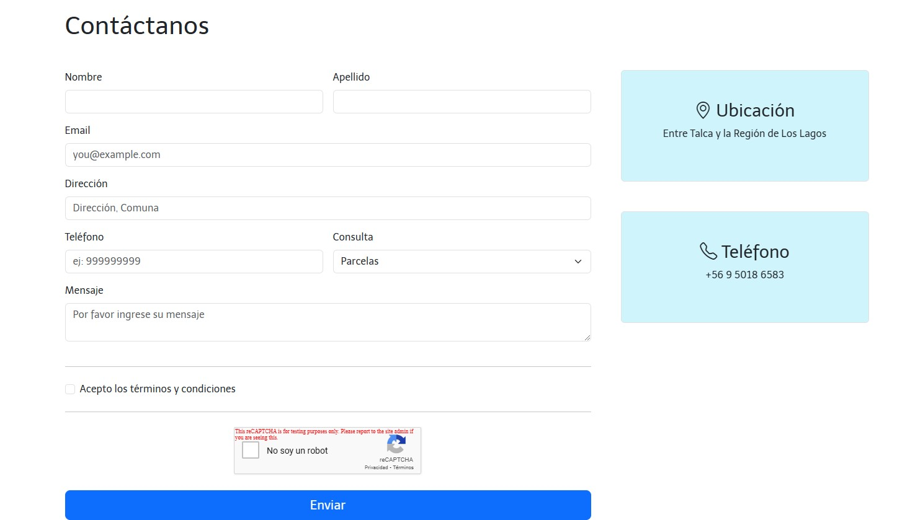
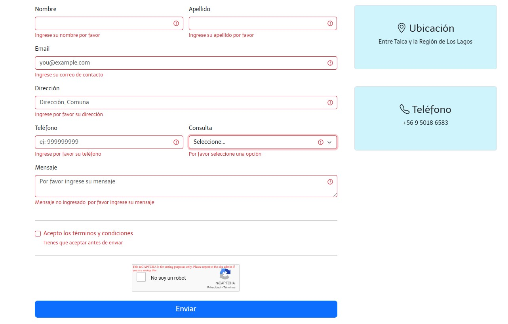
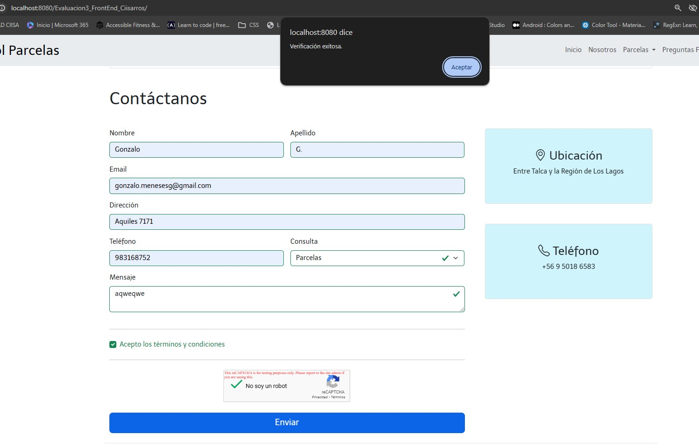
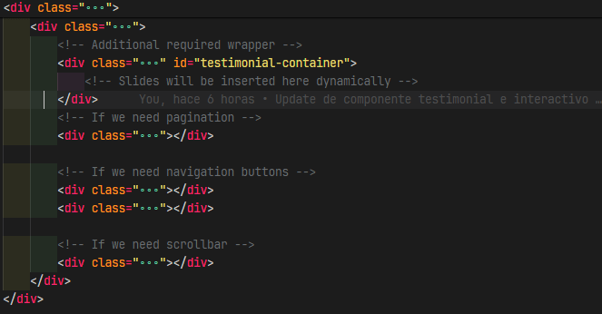
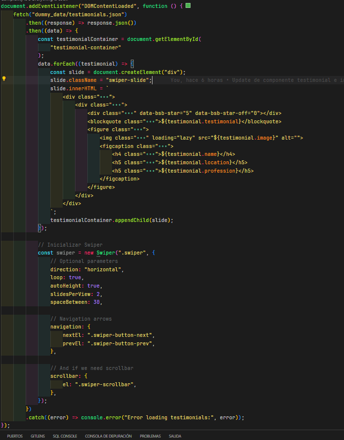
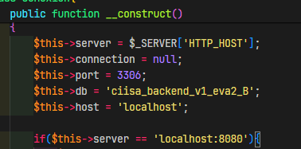
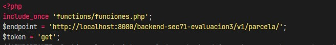

# Evaluacion3_FrontEnd_Ciisarros - Ramo de FrontEnd, IPSS - Sección 71
Integrantes:
* David Alejandro Robles Martinez
* Gabriel Fernando Sanhueza Pincheira
* Gonzalo Meneses Gonzalez
* Alvaro Andres Vargas Riveros

Docente:
* Sebastián Cabezas

## Capturas de Pantalla
### Header y seccion nosotros

### Componente parcelas

### Componentes de Testimonios y Preguntas Frecuentes

### Componente de Contacto

### Componente Contacto (sin data ingresada)

### Componente Contacto (Con datos ingresados más validación de reCaptcha)

### Footer más botón Al Inicio


## Guía de Buenas Prácticas

### Estructura del proyecto
```
└── 📁Evaluacion3_FrontEnd_Ciisarros
    └── 📁componentes
        └── card.php
        └── casa_en_parcela.php
        └── contacto.php
        └── footer.php
        └── header.php
        └── inicio.php
        └── nosotros.php
        └── parcelas.php
        └── preguntas.php
        └── solo_terreno.php
        └── testimonios.php
    └── 📁css
        └── styles.css
    └── 📁dummy_data
        └── testimonials.json
    └── fiveserver.config.js
    └── 📁functions
        └── funciones.php
        └── procesar_formulario.php
    └── 📁img
        └── bailey-anselme-Bkp3gLygyeA-unsplash.jpg
        └── bailey-anselme-Bkp3gLygyeA-unsplash.webp
        └── illiya-vjestica-W5FdAcHp7l8-unsplash.bak.jpg
        └── illiya-vjestica-W5FdAcHp7l8-unsplash.bak.webp
        └── jack-b-aLxqnaKgS9A-unsplash.jpg
        └── jack-b-aLxqnaKgS9A-unsplash.webp
        └── mina-rad-qFSQFSmfZkA-unsplash.jpg
        └── mina-rad-qFSQFSmfZkA-unsplash.webp
        └── peter-muscutt-pkg77ZtBCmg-unsplash.jpg
        └── peter-muscutt-pkg77ZtBCmg-unsplash.webp
        └── 📁screenshots
            └── contactanos-sindata.jpg
            └── contactanos-validacion-recaptcha.jpg
            └── contactanos.jpg
            └── header-nosotros.jpg
            └── parcelas.jpg
            └── testimonios-preguntas.jpg
        └── 📁testimonials
            └── testimonial-1.png
            └── testimonial-2.png
            └── testimonial-3.png
            └── testimonial-4.png
            └── testimonial-5.png
            └── testimonial-6.png
        └── tomasz-filipek-CUWC-6MRcNg-unsplash.jpg
        └── tomasz-filipek-CUWC-6MRcNg-unsplash.webp
        └── werner-sevenster-JuP0ZG0UNi0-unsplash.jpg
        └── werner-sevenster-JuP0ZG0UNi0-unsplash.webp
    └── index.php
    └── 📁js
        └── script.js
    └── README.md
    └── 📁sql
        └── insert_data.sql
        └── schema_user_tables_data_B.sql
```

#### A continuación se detallará la estructura de archivos
:file_folder: componentes
* La carpeta contiene todos los componentes utilizables en cada una de las secciones, el detalle de los componentes usados se encuentra en el archivo index.php

:file_folder: css
* Contiene el archivo styles.css, el cual incluye algunos estilados realizados en la página web

:file_folder: dummy_data
* Contiene el archivo testimonials.json, este archivo es un JSON creado por nosotros para insertar los testimoniales de forma dinámica en el componente testimonios



* Se hace a través del siguiente script:



:file_folder: functions
* Contiene 2 archivos, funciones.php y procesar_formulario.php

- funciones.php -> contiene la función para conectarse a la API
- procesar_formulario.php -> contiene función para procesar el formulario de contacto con recaptcha y envía notificaciones en caso de que no se haya validado (esto es solo para dev, se pueden implementar otras funciones)

:file_folder: img
* Contiene 2 carpetas, :file_folder: testimonials, la cual incluye las imágenes de 'usuarios' de los testimonios, :file_folder: screenshoots, incluye las capturas de pantalla y el resto de archivos son imágenes de ejemplo para usar en la web (en formato jpeg y webp para optimización)

:file_folder: js
* Contiene el archivo scripts.js que tiene las diversas funciones que hacen interactivo el sitio

Un ejemplo es esto, que genera de forma interactiva los testimonios y además utiliza la biblioteca Swiper JS para generar un carrusel interactivo

:file_folder: sql
* Contiene 2 archivos
* schema_user_tables_data_B.sql -> crea la BDD
* insert_data.sql -> inserta una parcela de ejemplo

### Instrucciones de instalación

* Crear la base datos con el archivo de la ruta :file_folder:sql/schema_user_tables_data_B.sql
* Insertar dato de ejemplo para la visualización de parcelas :file_folder:sql/inser_data.sql

! IMPORTANTE!
* Por temas de integración, se usó el puerto 8080, el cual en xampp no está configurado y lo tuve que modificar para que levantara

#### Puerto en BDD

#### Configuración de Puerto en index.php
